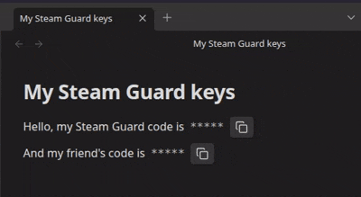
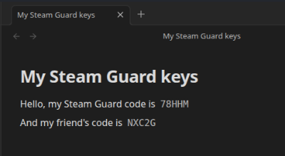

# 🔑 Simple Steam Auth

[](https://github.com/dreamscached/obsidian-simple-steam-auth/actions/workflows/check_on_push.yml)
[](https://github.com/dreamscached/obsidian-simple-steam-auth/releases/latest)
[](https://obsidian.md/plugins?id=simple-steam-auth)
[](https://github.com/dreamscached/obsidian-simple-steam-auth/blob/master/LICENSE)

A dynamic, real-time Steam Guard code component directly in your Obsidian notes!

## 🤔 Why?

This plugin is extremely convenient if you use multiple Steam accounts and need to
switch between them frequently. It is especially useful for bot developers (e.g., automated trading)
who manage dozens of accounts within their vault.

## 🎞️ Demo

| Hover to reveal                                  | Always revealed (unsafe)                          |
|--------------------------------------------------|---------------------------------------------------|
|  |  |

## 📦 How to install

This plugin is available in the Obsidian Community plugin list. Click [here](https://obsidian.md/plugins?id=simple-steam-auth)
to quickly install it directly within your Obsidian app.

## 📓 How to use

> [!NOTE]
> You are expected to know how to obtain the **shared secret** for your Steam account. If you don't,
> please refer to [this extensive guide](https://gist.github.com/mathielo/8367e464baa73941a075bae4dd5eed90).

After installing the plugin, simply create an **inline** code block with the following content inside
the backticks:

```
::steam-guard-code::YOUR_SHARED_SECRET_HERE
```

That's it! You now have quick access to your Steam Guard codes.

## 🔒 Security Considerations

Steam Guard codes are generated locally using the cryptographic secret you provide. Neither the secret nor
the generated codes ever leave your device.

However, be wary of other software (including other plugins) that could potentially access your Obsidian
vault to steal your secret. You should also be mindful of anyone who might see your screen while a code
is visible.

## 📜 Acknowledgements

During development, inspiration for various components was drawn from:

- [Dataview](https://github.com/blacksmithgu/obsidian-dataview) &mdash; Live Preview/Source mode
  separation and inline code span replacement
- [Steam TOTP](https://github.com/DoctorMcKay/node-steam-totp) &mdash; this plugin uses a version of
  the `steam-totp` npm library adapted for the browser JS environment
  ([patch](.yarn/patches/steam-totp-npm-2.1.2-aaff39ad0a.patch))

## ⚖️ License

This plugin is licensed under the GNU GPLv3 license.
