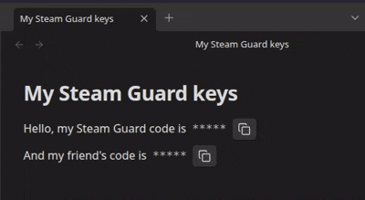

# 🔑 Simple Steam Auth

Dynamic, real-time updated Steam Guard code component right in your
Obsidian notes!

## 🎞️ Demo

| Hover-to-reveal                                   | Always revealed                                   |
|---------------------------------------------------|---------------------------------------------------|
|   |  |

## 📓 How to use

> [!NOTE]
> You are expected to be familiar with where to obtain the _shared_
> secret for your Steam account. If not &mdash; see [this](https://gist.github.com/mathielo/8367e464baa73941a075bae4dd5eed90)
> extensive guide.

After installing this plugin, simply create an _inline_ code block
with the following content inside the backticks:

```
::steam-guard-code::YOUR_SHARED_SECRET_HERE
```

That's it, now you have a quick access to your Steam Guard code.

## 🔒 Security considerations

Steam Guard codes are always generated locally, using the
cryptographic secret you've provided. Neither this secret nor the
generated code ever leaves your device.

However, be wary of the software (including other plugins) that can
potentially access your Obsidian vault and steal your secret, as
well as other people who may look at your device's screen and see
the code.
